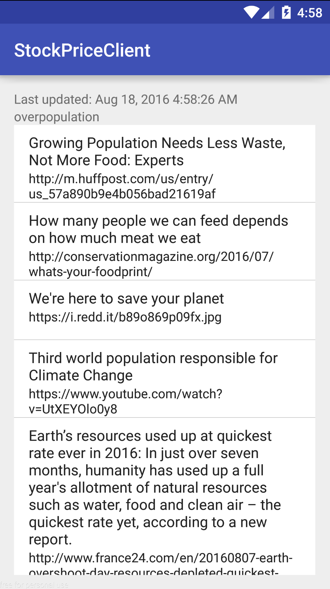

#  Sync Adapters Lab

## Introduction

> ***Note:*** _This should be done in pairs._

The solution code for this lab shows you how to build a stock portfolio app that updates every 60 seconds. Use the information you gain from this example to make calls to a random [reddit sub](https://www.reddit.com/r/random.json) once every 90 seconds. Your app should be able to show the current random subreddit as well as the title, url, and votes (if applicable) of each post in the sub. Make sure that each post is stored in the database. 

**Hint**
- Be very careful with the parsing for the reddit json object. It is much more difficult than the stock json object.
- Move slowly. Authenticator errors can pop up easily if you delete the wrong code. 

## Exercise

#### Requirements

- Display the top reddit articles for the random sub with relevant information (title, url, and votes)
- Update the displayed articles and subreddit using a Sync adapter every 90 minutes
- Store the data after each update in a local database
- Allow the user to navigate to the particular article when that article is clicked

**Bonus:**
- Allow the user to set the sync period
- Allow user to stop the sync
- Add the reddit article's image to the listview

#### Deliverable

An app that meets the above requirements.

